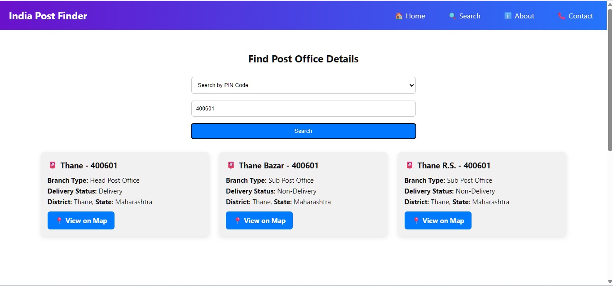
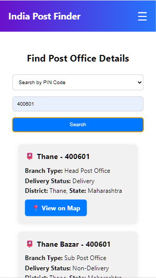

# 📮 India Post Finder

A responsive web application to search for Indian post offices by **Pincode** or **Area Name** using the official India Post API.

> 🔎 Simple UI | 📱 Fully Responsive | 🗺️ Google Maps Integration

---

## 🚀 Live Demo

👉 [Click to View Live Project](https://your-netlify-link.netlify.app)  
*(Replace with your Netlify link)*

---

## ✨ Features

- 🔍 Search post offices by Pincode or Area Name
- 📋 View post office details including Branch Type, Division, Circle, etc.
- 📱 Fully responsive design for mobile, tablet, and desktop
- 🗺️ View on Map (Google Maps integration)
- 🎨 Clean modern UI using CSS Flexbox and Media Queries

---

## 🛠️ Tech Stack

| Tech | Description |
|------|-------------|
| HTML | Page Structure |
| CSS  | Styling and Layout |
| JavaScript | Fetch API, DOM manipulation |
| India Post API | Real-time data for Pincode/Area |
| Google Maps | Map View links |
| Netlify | Hosting |

---

## 📸 Screenshots

### 🔎 Desktop Search View


### 📱 Mobile View


---

## 📂 Folder Structure

```
📦 IndiaPostFinder
├── index.html
├── style.css
├── script.js
├── README.md
└── /screenshots
```

---

## ⚙️ How to Run Locally

```bash
git clone https://github.com/Priyanshu-Kummar-Developer/IndiaPostFinder
cd IndiaPostFinder
open index.html   # or open in browser manually
```

---

## 📧 Contact

> 💬 Made with ❤️ by **Priyanshu Kumar**  
> 🔗 [LinkedIn](https://www.linkedin.com/in/priyanshu-kummar-developer)  
> ✉️ Email: your-priyanshujaiswara@gmail.com *(update if you want)*

---

## 📃 License

This project is open-source and free to use under the [MIT License](LICENSE).
